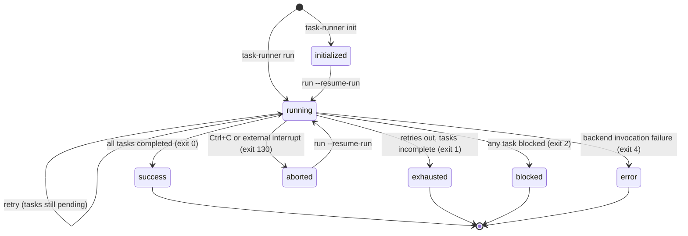
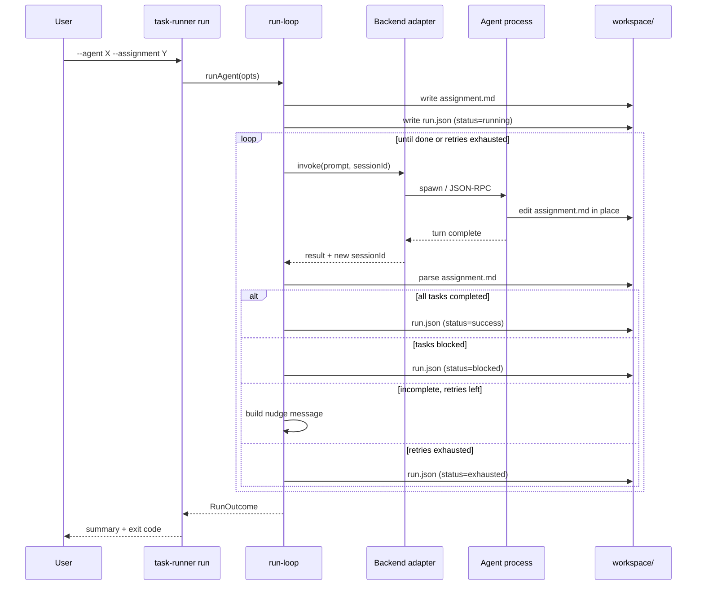
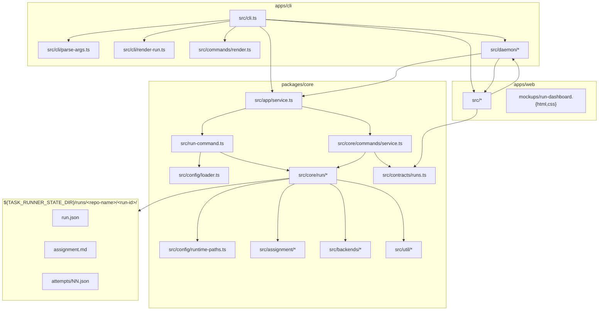

# task-runner

A small, focused CLI that drives an AI coding agent through a structured
task list, tracks per-task status, and retries until every task is
marked done or blocked.

You write a checklist. `task-runner` hands it to a backend (Claude or
Codex), the agent works through it and updates each task's status in
place, and the runner loops until the agent has accounted for every
task: if any are still `pending` when the agent ends its turn, it gets
re-invoked with a nudge — up to a configurable retry budget. Blocked
tasks halt the run cleanly. Aborted runs (Ctrl+C, external interrupt,
timeout) persist their state and can be resumed later.

It now supports two local host modes:

- **Embedded mode**: the foreground CLI process owns execution.
- **Daemon mode**: `task-runner serve` owns live runs over a local
  control plane. CLI commands still route through WebSocket
  JSON-RPC with `--connect` / `TASK_RUNNER_CONNECT`, while browser-style
  clients can use HTTP for request/response plus SSE for live run events.

It is still intentionally not a web console or a general orchestration
framework. The daemon is local-only and exists to stabilize run control
and future local clients, not to become a remote multi-user service.

---

## Table of contents

- [Why](#why)
- [Features](#features)
- [Install](#install)
- [Quickstart](#quickstart)
- [Concepts](#concepts)
  - [Agents and assignments](#agents-and-assignments)
  - [Tasks and the workflow](#tasks-and-the-workflow)
  - [Workspaces and the run manifest](#workspaces-and-the-run-manifest)
- [Commands](#commands)
  - [`task-runner run`](#task-runner-run)
  - [`task-runner init`](#task-runner-init)
  - [`task-runner serve`](#task-runner-serve)
  - [`task-runner run reset / archive / unarchive`](#task-runner-run-reset--archive--unarchive)
  - [`task-runner status`](#task-runner-status)
  - [`task-runner task` commands](#task-runner-task-commands)
  - [`task-runner list`](#task-runner-list)
  - [`task-runner show`](#task-runner-show)
- [Backends](#backends)
  - [Claude](#claude)
  - [Codex](#codex)
  - [Passive](#passive)
- [Resuming, aborting, importing](#resuming-aborting-importing)
- [Variables and interpolation](#variables-and-interpolation)
- [Locked fields](#locked-fields)
- [Output modes](#output-modes)
- [Exit codes](#exit-codes)
- [Environment variables](#environment-variables)
- [Bundled examples](#bundled-examples)
- [Development](#development)
- [Project layout](#project-layout)

---

## Why

If you've used a coding agent for any non-trivial task, you've seen
this loop:

1. You give the agent a list of things to do.
2. The agent confidently announces "all done!"
3. You check, and two of the five things weren't actually done.
4. You write another prompt: "you didn't finish X and Y, try again."
5. Repeat.

`task-runner` wraps that loop. The task list is structured (each task
has a stable id, a title, and a status the agent updates in place),
the runner parses the file after every turn, and a partial completion
just becomes another iteration with a programmatic nudge instead of a
hand-typed follow-up. When the agent gets it right, the run ends and
the runner emits a single JSON record with the full transcript, the
final per-task statuses, and the agent's notes.

It is also a useful primitive for orchestration scenarios — an outer
agent can compose an `assignment.md`, hand it to `task-runner`, and
get back a structured success/failure with no parsing of free-form
chat output.

## Features

- **Three backends**: Claude (subprocess wrapping `claude --print`),
  Codex (JSON-RPC managed mode over stdio or websocket), and Passive
  (null-object for sidecar flows — `init` + `task set` / `task add`
  only, task-runner never invokes a model).
- **Structured task tracking**: tasks have stable ids and statuses
  (`pending`, `in_progress`, `completed`, `blocked`) that the agent
  updates in place; the runner parses the workspace `assignment.md`
  after every turn and re-invokes with a precise list of what the
  agent hasn't yet marked done. The runner does not independently
  verify work — it trusts the status the agent wrote — so the checklist
  acts as a structured reminder and audit trail, not a proof of
  completion. See [What the checklist does and doesn't do](#what-the-checklist-does-and-doesnt-do).
- **Retries with budget**: configurable per-attempt timeout and per-run
  retry count. Blocked tasks short-circuit the loop.
- **Resumable runs**: every run persists a canonical `run.json`
  manifest plus per-attempt logs. `--resume-run <id>` continues an
  existing run, reuses the backend's session id where supported, and
  can carry forward task statuses and notes.
- **Init then execute**: `task-runner init` prepares the workspace
  without invoking the backend, returns a run id, and `task-runner
  run --resume-run <id>` later picks it up. Useful when an outer
  process wants to compose a run before committing to it.
- **Dual-host local control plane**: embedded mode keeps the
  single-process CLI path for simple use, while daemon mode moves live
  run ownership, event streaming, and external abort control into a
  long-lived local `task-runner serve` process reached over
  `ws://127.0.0.1:4773/` by default for CLI WebSocket JSON-RPC, with a
  browser-facing HTTP API and SSE stream on the same listener.
- **Run dashboard web app**: `apps/web` ships a same-origin browser UI
  for run status, filtering, archive toggles, and deep-linkable run
  detail routes. The app loads runtime config from `/app-config.json`,
  reads/actions over HTTP, stays fresh over SSE, and follows the
  canonical phase-1 visual contract in
  `apps/web/mockups/run-dashboard.{html,css}`.
- **Live status inspection**: `task-runner status <id>` reads the
  manifest and (for in-flight runs) overlays the live workspace
  `assignment.md` so you can see mid-attempt progress without
  attaching to anything.
- **Run discovery and archiving**: `task-runner list runs` enumerates
  current-generation run manifests across the state root, `run
  archive` / `run unarchive` toggle a run-level archive marker, and
  archived runs are hidden from default listings and rejected by
  `--resume-run` until unarchived.
- **Sidecar task mutation**: `task-runner task set` / `task add` let
  an external agent or script drive a run's task list through the CLI
  without task-runner ever invoking a backend. Pair with the
  [Passive backend](#passive) for a first-class sidecar agent that
  rejects `run` entirely and auto-finalizes the manifest to `success`
  or `blocked` once every task reaches a terminal status.
- **Clean Ctrl+C**: SIGINT aborts the in-flight backend invocation
  cleanly (claude gets SIGINT, codex gets `turn/interrupt`), persists
  the manifest as `aborted`, and exits 130. Resume any time with
  `--resume-run`.
- **External interrupt detection**: when running against codex
  managed mode, if another client cancels the turn from the side
  (e.g. you attached the codex CLI to the same thread), task-runner
  notices and stops cleanly instead of treating it as a failure to
  retry.
- **Import existing sessions**: `--backend-session-id <id>` adopts an
  existing claude session UUID or codex thread id. Validated
  read-only before any workspace creation.
- **Locked fields**: agents and assignments can declare which fields
  the caller is allowed to override. Useful for distributing an
  agent that pins its own model or working directory.
- **Caller instructions**: assignments can carry a
  `callerInstructions` field with documentation for the *human or
  script* invoking task-runner (as opposed to the agent doing the
  work). Printed to stderr on fresh `run` / `init` with `{{var}}`
  interpolation, never sent to the backend, and always retrievable
  via `status --output-format json --field callerInstructions`. The
  audience split — one text block for the agent, one for the caller
  — keeps each free of noise meant for the other.
- **Recursion guard**: a hard cap (default 1) on nested
  `task-runner run` invocations, propagated through the env, so an
  orchestrator agent can't accidentally fork-bomb itself. If the cap
  is hit, the runner exits with a clear error telling you to raise
  `TASK_RUNNER_MAX_CALL_DEPTH` if the nesting is intentional.
- **JSON output mode** for scripting: `task-runner status
  --output-format json` returns the shared `RunDetail` DTO, and
  `task-runner run --output-format json` writes the final
  manifest-shaped run record.

## Install

Requirements:

- **Node.js 20+**
- **Claude CLI** (`claude`) on your `PATH` if you want to use the
  Claude backend, or set `TASK_RUNNER_CLAUDE_BIN` to point at it.
- **Codex CLI** (`codex`) for stdio mode, or a running codex
  app-server reachable over WebSocket via
  `TASK_RUNNER_CODEX_WS_URL=ws://host:port`.

Build (from the repo root):

```bash
npm install
npm run build
```

The built CLI entrypoint is now `node apps/cli/dist/cli.js`. Either
link the CLI workspace with `npm link --workspace apps/cli`, add a
shell alias, or invoke it through `npm run task-runner -- ...`.
Builds also mark `apps/cli/dist/cli.js` executable on Unix-like
systems.

## Quickstart

The examples below assume `task-runner` is on your `PATH` (via
`npm link --workspace apps/cli` or a shell alias). If it isn't,
substitute `node apps/cli/dist/cli.js` for `task-runner` in every
command.

```bash
# Run the bundled "example" agent against the bundled "repo-orientation"
# assignment, pointed at any repo:
task-runner run \
  --agent ./agents/example/agent.md \
  --assignment ./assignments/repo-orientation/assignment.md \
  --var repo_path=/path/to/some/repo

# Inspect the run after the fact (or during, with live overlay):
task-runner status <run-id>

# Get the full run detail as JSON:
task-runner status <run-id> --output-format json
```

A run produces a workspace under
`${TASK_RUNNER_STATE_DIR:-$HOME/.local/state/task-runner}/runs/<repo-name>/<run-id>/`
with:

- `run.json` — canonical manifest, written after every attempt
- `assignment.md` — the per-task checklist the agent edits in place
- `attempts/NN.json` — raw per-attempt stdout/stderr capture

The text output looks roughly like:

```
task-runner: agent=example run=abc123
             source=/.../assignments/repo-orientation/assignment.md
             assignment=/.../.local/state/task-runner/runs/<repo-name>/abc123/assignment.md
             cwd=/path/to/some/repo

── attempt 1 ──
<agent output streams here>

── summary ──
Status: success
Tasks completed: 3/3
Attempts: 1/4
Assignment file: /.../.local/state/task-runner/runs/<repo-name>/abc123/assignment.md

Task results:
  - read_conventions — Check repo conventions [completed]
      2-space indent; biome for lint/format; tests via node:test.
  - inventory_packages — Inventory top-level packages [completed]
      ...
  - summary — Summary [completed]
      Small TS monorepo for an AI agent runner with two backends.

To continue this run with a follow-up message:
  task-runner run --resume-run abc123 "..."
```

---

## Concepts

### Agents and assignments

A run is the composition of two files:

- **Agent** (`agents/<name>/agent.md`) is the *identity* — backend,
  model, effort level, working directory, role instructions, and
  any locks the agent wants to enforce. Reusable across many
  different work packages.
- **Assignment** (`assignments/<name>/assignment.md`) is the *work* —
  task list, input variables, optional default message, optional
  session display name. Reusable across many different agents.

A minimal agent:

```yaml
---
schemaVersion: 1
name: example
backend: claude
model: claude-sonnet-4-6
effort: medium
unrestricted: true
---
You are a repository orientation assistant. Be concrete and cite
file paths and line numbers.
```

A minimal assignment:

```yaml
---
schemaVersion: 1
name: repo-orientation
sessionName: orient {{repo_path}}      # optional display label
maxRetries: 3                          # retry budget per session, default 3
vars:
  repo_path:
    type: string
    required: true
    source: cli
# Optional: documentation printed to the CALLER (the human or script
# running task-runner), never sent to the backend. Shown on stderr at
# fresh `run` / `init` only. Interpolates {{vars}} like other body
# fields. Re-fetch any time with:
#   task-runner status <id> --output-format json --field callerInstructions
callerInstructions: |
  Your run id is {{run_id}}. The structured report lands in
  {{assignment_path}} — parse per-task notes blocks for findings.
tasks:
  - id: read_conventions
    title: Check repo conventions
    body: |
      Read AGENTS.md and CLAUDE.md (if present). Capture the coding
      style, test requirements, and PR conventions in this task's
      Notes block.
  - id: inventory_packages
    title: Inventory packages
    body: List the top-level packages and what each one does.
---
You are working on the repository at `{{repo_path}}`. Plan at
{{assignment_path}}.
```

Both can be passed by direct path, or by bare name if the definition
is installed under `TASK_RUNNER_CONFIG_DIR` (default:
`$XDG_CONFIG_HOME/task-runner` or `~/.config/task-runner`). Bare names
do not fall back to `./agents/` or `./assignments/`; definitions in
the repo checkout should be referenced by path unless you export
`TASK_RUNNER_CONFIG_DIR=$PWD`. `--assignment` is optional — running an
agent with no assignment is "chat mode" (no enforced task list, just a
single backend invocation).

**`--agent` is also optional.** When omitted, task-runner synthesizes
an **ad-hoc agent** from CLI overrides — useful for quick one-off
runs, scripted orchestration, or any flow where a dedicated
`agent.md` file would be overkill. Ad-hoc agents are named `ad-hoc`
(a reserved name — on-disk agents can't use it), have no role
instructions body, and require `--backend` to be passed explicitly
(everything else falls back to sensible defaults). For example:

```bash
# Passive ad-hoc run — no agent file, no model calls, just a
# structured checklist driven by task set / task add.
task-runner init --backend passive \
  --assignment ./assignments/repo-diagnostics/assignment.md \
  --var repo_path=.

# Codex ad-hoc run — backend + model from the CLI, assignment for
# the task list, no agent.md required.
task-runner run --backend codex --model gpt-5.4 --effort high \
  --assignment ./assignments/code-review/assignment.md \
  --var repo_path=. --var range=HEAD~3..HEAD
```

Ad-hoc agents have `lockedFields: []` (nothing is locked by default)
and an empty role-instructions body. If you need role instructions
or locks, create a real `agent.md`.

### Tasks and the workflow

A run progresses through a small state machine; terminal states map
1-to-1 onto process exit codes.



When a run starts, the runner renders the assignment's task list to
the workspace `assignment.md` as a fenced markdown document with one
section per task. Each task section contains a `**Status:**` field
and a `<!-- notes:start --> ... <!-- notes:end -->` block.

The runner injects a workflow preamble into the agent's first prompt
that says, in essence: "for each task, set Status to `in_progress`,
do the work, write your findings into the Notes block, set Status
to `completed`. Use `blocked` if you can't finish; the runner will
stop and surface that to the user instead of retrying."

After every backend invocation, the runner re-reads the workspace
`assignment.md`, parses out the per-task updates, and:

- If every task is `completed` → success, run ends.
- If any task is `blocked` → blocked, run ends, exit code 2.
- If retries are exhausted with incomplete tasks → exhausted, exit 1.
- Otherwise → re-invoke with a nudge listing what's still pending.

Task ids are stable across invocations so retries can address
incomplete work precisely.

#### What the checklist does and doesn't do

The runner trusts the `**Status:**` string the agent writes — it does
not independently verify that a task's work was actually done. What
the structure *does* buy you is that the agent cannot silently skip
an item: every task must be explicitly accounted for (`completed`,
`blocked`, or left `pending` and retried), and the per-task Notes
block captures evidence you can audit after the fact. If you need
harder guarantees, encode them into the task body itself — e.g.,
"run `npm test` and paste the exit code into Notes," or "open the
file at `src/foo.ts` and paste the top-level exports."

One run attempt, from CLI to backend and back:



### Workspaces and the run manifest

Each run gets a workspace directory at
`${TASK_RUNNER_STATE_DIR}/runs/<repo-name>/<run-id>/` with three things
in it:

- **`run.json`** — the canonical record, written at run start,
  rewritten after every attempt, and one final time on terminal
  state. A single JSON document — never JSONL, never append-only —
  so you can `cat` or `jq` it at any moment. Contains the agent
  identity *and* a frozen snapshot of the agent's role instructions,
  locked fields, and timeout budget, plus the assignment metadata,
  every attempt record, the final per-task snapshot, the resolved
  vars, and the captured backend session id.
- **`assignment.md`** — the I/O buffer the agent edits in place. The
  *source* assignment file is never mutated; the runner copies it
  here on a fresh run and re-reads it after every turn.
- **`attempts/NN.json`** — raw per-attempt logs (stdout, stderr,
  start/end timestamps), one per backend invocation. Useful for
  forensics.

The manifest is the load-bearing piece: **it is the canonical source
of truth for a run after first write**. Every other CLI command
(`status`, `run --resume-run`, `task set` / `task add`) reads from
the manifest and **never re-reads the agent's source file on
resume**. Moving, editing, or deleting `agent.md` after a run has
started has no effect on that run — it lives off the frozen snapshot
in `run.json`. This also makes ad-hoc agents (see above) possible:
once the manifest is written, the agent had no source file to begin
with and the run doesn't care.

Manifest schema is versioned — the current generation is
`schemaVersion: 3`. Older runs (v1 pre-canonical and v2
pre-reset-seed) are not resumable under this version of task-runner;
attempting to do so surfaces a clear error and you're expected to
start a fresh run.

For the full schema and the rationale, see
[`docs/design.md`](docs/design.md).

---

## Commands

Host selection:

- Without `--connect` / `TASK_RUNNER_CONNECT`, commands run in
  **embedded mode** and call the shared app services in-process.
- With `--connect <ws-url>` or `TASK_RUNNER_CONNECT=<ws-url>`, the CLI
  runs in **daemon mode** and routes the entire command through the
  local daemon API. If nothing is listening there, the command fails
  with exit code `3`; it does not silently fall back to embedded mode.

### `task-runner run`

Execute an agent. Three modes, distinguished by which flags you pass:

```bash
# Fresh run
task-runner run --agent <name> [--assignment <name>] [options] [message]

# Resume an existing run (sends a follow-up message and/or new tasks)
task-runner run --resume-run <id> [options] [message]

# Execute a previously initialized run (see `init` below)
task-runner run --resume-run <id>
```

Common options:

| Flag | Purpose |
|---|---|
| `--agent <name\|path>` | Agent name or direct path. **Optional on fresh runs** — when omitted, task-runner synthesizes an ad-hoc agent from CLI overrides (in that case `--backend` is required). **Forbidden with `--resume-run`** — the agent is reconstructed from the frozen manifest, not re-read from disk. |
| `--assignment <name\|path>` | Assignment name or direct path. Optional on fresh runs. Forbidden on resume. |
| `--resume-run <id\|path>` | Continue an existing run by short id, workspace path, or direct `run.json` path. Archived runs must be unarchived first. See [Resuming, aborting, importing](#resuming-aborting-importing) for the full resume-override policy. |
| `--var key=value` (repeatable) | Set an input variable. Validated against the assignment's `vars` schema. **Forbidden with `--resume-run`** — vars are resolved once at first write and frozen into the manifest; they aren't re-resolved on resume. |
| `--add-task "<title>"` (repeatable) | Append an ad-hoc task with auto-generated id `cli-<short>`. |
| `--cwd <path>` | Override the agent's `cwd`. **Forbidden with `--resume-run`** — backend sessions are bound to their creation cwd, so a new cwd would invalidate the captured session id. Create a fresh run if you need a different cwd. |
| `--backend <claude\|codex\|passive>` | Override the agent's backend. Drops the agent's `model` unless `--model` is also passed. Forbidden with `--resume-run` (the backend is locked to the session that created the run). Required when `--agent` is omitted (ad-hoc synthesis). |
| `--task-mode <file\|cli>` | Override the assignment's task workflow mode for a fresh `run` or `init`. Forbidden with `--resume-run` because the chosen mode is frozen into the manifest at first write. |
| `--model <id>` | Override the model. Backend-specific (`claude-sonnet-4-6`, `gpt-5.4`, etc.). |
| `--effort <off\|minimal\|low\|medium\|high\|xhigh\|max>` | Reasoning effort. Mapped per backend. |
| `--max-retries <n>` | Override the per-run retry budget (default 3). |
| `--timeout-sec <n>` | Override the per-attempt timeout (default 3600). |
| `--unrestricted` | Bypass the backend's approval prompts. |
| `--session-name <name>` | Override the assignment's `sessionName` (the backend display label). Vars are interpolated. |
| `--backend-session-id <id>` | Adopt an existing backend session id (claude UUID, codex thread id). Validated before workspace creation. Forbidden with `--resume-run` (the resume target already carries one). |
| `--connect <ws-url>` | Route the command through the local daemon instead of embedded mode. Also honored from `TASK_RUNNER_CONNECT`. |
| `--output-format <text\|json>` | Default `text`. `json` writes the final manifest-shaped run record to stdout once at end of run. |

On `--resume-run`, the "legitimate mid-run" overrides — `--model`,
`--effort`, `--timeout-sec`, `--max-retries`, `--unrestricted`,
`--session-name` — are still accepted (and still vetted against the
frozen `manifest.lockedFields`). **Execute-after-init** (resuming a
run whose prior status was `initialized`) rejects **every** override —
init deliberately froze every resolvable field and the only valid
invocation is `task-runner run --resume-run <id>`. See
[Resuming, aborting, importing](#resume) for the full matrix.

### `task-runner init`

Prepare a run *without* invoking the backend. Same flags as `run`,
but stops after writing the workspace, manifest (`status:
"initialized"`), and the frozen prompt. Returns the run id; resume
later with `task-runner run --resume-run <id>`.

```bash
task-runner init \
  --agent ./agents/example/agent.md \
  --assignment ./assignments/repo-orientation/assignment.md \
  --var repo_path=/some/repo
# task-runner: initialized agent=example run=abc123
#              ...
#              resume with: task-runner run --resume-run abc123
```

Useful when an outer process wants a resumable handle before
committing to execution, or wants to inspect the prepared workspace
before kicking off the actual work.

### `task-runner serve`

Start the local daemon host:

```bash
task-runner serve
task-runner serve --listen ws://127.0.0.1:4773/
```

Rules:

- The daemon keeps the existing JSON-RPC 2.0 WebSocket control plane for
  CLI clients.
- The same listener also serves browser-facing HTTP endpoints
  under `/api/...` and live run events via SSE under `/api/events/...`.
- `--listen` overrides `TASK_RUNNER_LISTEN`; both fall back to
  `ws://127.0.0.1:4773/`.
- Run-scoped commands, `list runs`, and definition read commands opt
  into daemon mode with `--connect <ws-url>` or `TASK_RUNNER_CONNECT`.
- External live abort control exists only in daemon mode.

Transport split:

- CLI uses the WebSocket JSON-RPC transport.
- Browser/local web code should use HTTP for normal request/response and
  SSE for live run events.
- A default listener such as `ws://127.0.0.1:4773/` therefore also exposes
  HTTP at `http://127.0.0.1:4773/api/`.
- The same host also serves the built web app and runtime config:
  `http://127.0.0.1:4773/` for the SPA and
  `http://127.0.0.1:4773/app-config.json` for the phase-1 frontend
  config payload.

Web dashboard notes:

- `apps/web` is a real workspace package built with Vite + React.
- Normal local use is same-origin: `task-runner serve` hosts the built
  frontend plus `/api/*` and `/api/events/*`.
- Client routing is deep-linkable: `/` shows the board and
  `/runs/:runId` opens the selected-run drawer/sheet.
- The canonical visual contract lives in
  `apps/web/mockups/run-dashboard.html` and
  `apps/web/mockups/run-dashboard.css`. The React UI should match that
  layout and visual language unless a later change explicitly justifies
  divergence.
- Development uses the Vite dev server in `apps/web` with a proxy for
  `/api/*`, `/api/events/*`, and `/app-config.json` back to the local
  daemon host.

### `task-runner run reset / archive / unarchive`

Restore an existing non-running run to the same initialized state it
had immediately after `task-runner init` or first-write on a fresh
run.

```bash
task-runner run reset <run-id>
task-runner run reset <run-id> --output-format json
```

Reset semantics:

- Allowed for `initialized`, `success`, `blocked`, `exhausted`,
  `aborted`, and `error` runs.
- Rejected while `status=running`, regardless of `taskMode`.
- Works for both passive and non-passive runs.
- Rewrites `run.json` and the workspace `assignment.md` from the
  manifest's frozen initialized-state seed; it does **not** re-read
  the current agent or assignment source files from disk.
- Restores the initialized prompt/task snapshot, clears
  `backendSessionId`, zeroes session/attempt history, and removes
  stale `attempts/` artifacts so the next execution starts clean.

Success output:

```text
task-runner: reset run abc123 to initialized state
```

```json
{
  "runId": "abc123",
  "status": "initialized"
}
```

Archive toggles are orthogonal to `status`: they keep the run's
current lifecycle state but add or clear `manifest.archivedAt`. By
default `task-runner list runs` hides archived runs, and
`task-runner run --resume-run <id>` rejects them until unarchived.

```bash
task-runner run archive <run-id>
task-runner run archive <run-id> --output-format json

task-runner run unarchive <run-id>
task-runner run unarchive <run-id> --output-format json
```

Archive semantics:

- Allowed for any non-running run.
- Rejected while `status=running`.
- Idempotent: archiving an already archived run and unarchiving an
  unarchived run both succeed with `changed: false` in JSON mode.
- `status`, `endedAt`, task state, and attempt/session history are
  preserved; only `archivedAt` changes.

Success output:

```text
task-runner: archived run abc123
task-runner: unarchived run abc123
```

```json
{
  "runId": "abc123",
  "status": "success",
  "archivedAt": "2026-04-12T18:41:00.000Z",
  "changed": true
}
```

### `task-runner status`

Read-only inspector. Resolves a run by short id (looked up in the
current repo-name bucket under `${TASK_RUNNER_STATE_DIR}/runs/`, then
`runs/unknown/`), workspace path, or direct `run.json` path.

```bash
# Human-readable status block + per-task checklist
task-runner status <id>

# Full run detail as JSON
task-runner status <id> --output-format json

# Just the fields you care about
task-runner status <id> --output-format json \
  --field status --field tasksCompleted --field tasksTotal
```

Options:

| Flag | Purpose |
|---|---|
| `--output-format <text|json>` | Default `text`. `json` prints the full `RunDetail` JSON contract. |
| `--field <name>` (repeatable) | When `--output-format json`, restrict output to these top-level `RunDetail` fields. |

When the resolved manifest's status is `running`, `status` behaves by
task mode:

- `taskMode=file`: parse the workspace `assignment.md` and overlay the
  live task statuses + notes onto the output.
- `taskMode=cli`: read canonical task state directly from
  `run.json.finalTasks`. `assignment.md` is render-only in this mode,
  so there is no live file overlay.

When `manifest.archivedAt` is non-null, text output includes the
archive timestamp plus an unarchive hint, and JSON output exposes the
same top-level `archivedAt` field.

The JSON `RunDetail` contract also carries a machine-facing
`capabilities` block:

- `canArchive`, `canUnarchive`, `canResume`
- `taskMutation.canSetStatus`
- `taskMutation.canEditNotes`
- `taskMutation.canAdd`

These booleans reflect the current CLI-backed lifecycle rules. In
particular, passive runs are never resumable through `run`, running
`taskMode=cli` runs allow `task set` / `task append-notes` but not
`task add`, and terminal non-passive runs remain notes-editable but do
not allow task status changes or task creation.

In daemon mode, external live abort control is available through the
daemon-owned run lifecycle. Embedded mode remains single-process and
does not expose external live control.

### `taskMode: file` vs `taskMode: cli`

Assignments default to `taskMode: file` when the field is omitted. A
fresh `run` or `init` may override the assignment with
`--task-mode <file|cli>`; resume reads the frozen manifest value.

- `taskMode=file`: the agent is oriented around the workspace
  `assignment.md` path and updates task status/notes by editing the
  file. While a non-passive run is `running`, task CLI mutation stays
  rejected.
- `taskMode=cli`: the agent is oriented around the run id plus task
  commands (`task list`, `task show`, `task set`, `task append-notes`,
  `status`). `run.json.finalTasks` is the live source of truth,
  `assignment.md` is rendered from that state for human audit, and
  `task set` / `task append-notes` are allowed while a non-passive run
  is `running`.
- `task add` remains rejected while a non-passive run is `running`,
  even in `taskMode=cli`. Live mutation in v1 is limited to status and
  notes on existing tasks.

### `task-runner task` commands

Mutate a run's task list **without invoking the agent**. The canonical
use case is a *sidecar* flow: you have an agent that can't (or
shouldn't) be invoked as a task-runner subprocess, but you still want
it to work through a structured task list. `init` seeds the list, the
external agent reads it via `status`, works each task, and reports
progress back through the task CLI.

The task subcommands are:

- `task list <run-id>` — list tasks in stable order.
- `task show <run-id> <task-id>` — show one task snapshot.
- `task set <run-id> <task-id>` — replace status and/or notes.
- `task append-notes <run-id> <task-id>` — append notes with a single
  newline join rule.
- `task add <run-id>` — add a new pending task, with optional `--body`.

Read commands (`task list`, `task show`) always read canonical task
state from `run.json.finalTasks`; they never invoke a backend.

Mutation commands:

- Require an existing run (as id or workspace path).
- Use a shared per-run persistence lock so `run.json` and rendered
  `assignment.md` stay in sync.
- `taskMode=file`: reject mutation while a non-passive run is
  `running`.
- `taskMode=cli`: allow `task set` and `task append-notes` while a
  non-passive run is `running`; canonical task state lives in
  `run.json.finalTasks` and `assignment.md` is rendered from it.
- On terminal non-passive runs, only notes-only `task set` /
  `task append-notes` are allowed; `task add` and status-changing
  `task set` are rejected.

```bash
# Inspect tasks
task-runner task list <run-id>
task-runner task show <run-id> <task-id>

# Mark a task in-progress
task-runner task set <run-id> <task-id> --status in_progress

# Add a notes block without changing status
task-runner task set <run-id> <task-id> --notes "Investigating the parser."

# Append to the existing notes body
task-runner task append-notes <run-id> <task-id> --text "Captured CLI-mode details."

# Complete a task with a note in one call
task-runner task set <run-id> <task-id> --status completed --notes "Done."

# Append a new task to an initialized run
task-runner task add <run-id> --title "Follow-up cleanup" --body "Update docs."

# JSON output returns the updated task snapshot (handy for scripts)
task-runner task set <run-id> <task-id> --status completed --output-format json
```

`task set` options:

| Flag | Purpose |
|---|---|
| `--status <s>` | Target status (`pending`, `in_progress`, `completed`, `blocked`). |
| `--notes <text>` | Replacement notes body (replaces, does not append). |
| `--output-format <text\|json>` | Default `text`. `json` prints the updated task snapshot. |

At least one of `--status` / `--notes` must be supplied.

`task append-notes` options:

| Flag | Purpose |
|---|---|
| `--text <text>` (required) | Appended note text. Trimmed before joining. |
| `--output-format <text\|json>` | Default `text`. `json` prints the updated task snapshot. |

`task add` options:

| Flag | Purpose |
|---|---|
| `--title <text>` (required) | Title for the new task. Non-empty, single-line, ≤ 200 chars. |
| `--body <text>` | Optional task body. Defaults to empty string. |
| `--output-format <text\|json>` | Default `text`. `json` prints the new task snapshot. |

`task add` honors the `tasks` locked field the same way `--add-task`
does on a fresh run: if either the agent or the assignment locks
`tasks`, the command is rejected. Generated ids follow the same
`cli-<short-id>` scheme as `--add-task`.

**Sidecar example.** Drive an initialized run from an external
agent/script without ever invoking a backend through task-runner:

```bash
# 1. Seed the workspace (no backend call)
task-runner init \
  --agent ./agents/code-reviewer/agent.md \
  --assignment ./assignments/code-review/assignment.md \
  --var repo_path=. --var range=main..HEAD
# -> prints: task-runner: initialized agent=code-reviewer run=abc123

# 2. External agent asks: "what's left to do?"
task-runner status abc123 --output-format json --field tasks

# 3. External agent works a task and reports progress
task-runner task set abc123 review_accessibility --status in_progress
# ...agent does the work...
task-runner task set abc123 review_accessibility --status completed --notes "LGTM"

# 4. Optionally add a task the script discovered along the way
task-runner task add abc123 --title "Follow-up: address flakey test"

# 5. Loop until status JSON shows all tasks terminal.
```

For a **non-passive backend** (claude or codex), the run stays in
`initialized` state the whole time and is still fully resumable: if
you later want to hand it to a subprocess agent, `task-runner run
--resume-run abc123` executes it normally. The CLI task commands and
the subprocess execution path compose cleanly.

For a **passive backend** the contract is different: task mutations
*auto-finalize* the manifest (success / blocked / initialized is
re-derived from the task map on every call), and `task-runner run`
is rejected outright. See the [Passive backend](#passive) section
below for the full lifecycle.

### `task-runner list`

Enumerate available agent or assignment definitions, or known runs.
Definition discovery is config-root only; run discovery scans
`${TASK_RUNNER_STATE_DIR}/runs/*/*/run.json` and returns
current-generation manifests whose recorded workspace paths still
match the containing directory. `list` is read-only in all modes.

```bash
# List all agents
task-runner list agents

# List all assignments (JSON output)
task-runner list assignments --output-format json

# List non-archived runs
task-runner list runs

# Include archived runs in the inventory
task-runner list runs --include-archived --output-format json
```

Options:

| Flag | Purpose |
|---|---|
| `--output-format <text\|json>` | Default `text`. Definition JSON returns `{ name, path, root }[]`; run JSON returns `RunListEntry[]` including `runId`, `status`, `archivedAt`, repo/agent/assignment names, cwd, timestamps, task counts, and `capabilities` so list/board consumers can render available actions without extra `status` reads. |
| `--include-archived` | `list runs` only. Include runs whose `archivedAt` is non-null. |

### `task-runner show`

Print details of a specific agent or assignment definition. Accepts a
bare name resolved from the config root or a direct file path.
Read-only.

```bash
# Show an agent by name
task-runner show agent ./agents/example/agent.md

# Show an assignment by path (JSON output)
task-runner show assignment ./assignments/repo-orientation/assignment.md \
  --output-format json
```

Options:

| Flag | Purpose |
|---|---|
| `--output-format <text\|json>` | Default `text`. `json` returns `{ config, instructions, sourcePath }`. |

---

## Backends

### Claude

Wraps the `claude` CLI in `--print --output-format stream-json`
mode. Streams partial assistant text to stdout, captures the session
id from the system init event, persists it for resume, and uses
`--resume <id>` to continue. Set `TASK_RUNNER_CLAUDE_BIN` to use a
custom binary.

### Codex

Speaks the codex JSON-RPC app-server protocol in managed mode.
Default transport is stdio (spawns the `codex` CLI as a subprocess);
set `TASK_RUNNER_CODEX_WS_URL=ws://host:port` to connect to a
running app-server over WebSocket instead. Codex over WebSocket has
a useful property: multiple clients can attach to the same thread,
so you can connect with the codex CLI in another terminal and watch
or even interact while task-runner is driving the agent.

If you cancel the turn from another client mid-attempt, task-runner
notices the external interrupt and stops cleanly with status
`aborted` instead of retrying — see [Resuming, aborting,
importing](#resuming-aborting-importing).

The runner sends `thread/start` (or `thread/resume`) at session
start, optionally `thread/name/set` if the assignment provided a
`sessionName`, then `turn/start` for each attempt and `turn/interrupt`
on timeout, abort, or external Ctrl+C.

### Passive

A null-object backend for runs that task-runner will never execute.
Passive agents are driven externally — a script or out-of-process
agent calls `task-runner init` to create the run, reads the task list
and role instructions via `status`, and reports progress back
through `task set` / `task add`. task-runner acts purely as a
structured checklist service, with no LLM involvement.

Declare a passive agent like any other:

```yaml
---
schemaVersion: 1
name: my-passive-agent
backend: passive
lockedFields:
  - backend
---
Role instructions for the external driver (a human reader or the
agent that will run the task list).
```

Passive-specific behavior:

- **`task-runner run` is rejected** on passive agents with a clear
  pointer to `init` and `task set`. Applies to fresh runs and
  `--resume-run` alike.
- **`task-runner run reset` is allowed** on passive runs. It restores
  the original initialized task set, rewrites `assignment.md`, keeps
  the run externally driven, and clears prior task-history-derived
  terminal state back to `initialized`.
- **`task-runner init` prints the full bootstrap** — the composed
  agent instructions + assignment context + CLI workflow reminder —
  to **stdout**, so you can pipe it: `task-runner init ... >
  /tmp/brief.txt`. Brief progress lines still go to stderr.
- **`task set` / `task add` auto-finalize** the run. After every
  mutation, the manifest status is re-derived from the task map:
  - any `pending` or `in_progress` task → `initialized`
  - all terminal, at least one `blocked` → `blocked` (exit code 2)
  - all `completed` → `success` (exit code 0)
  
  Self-healing: reopening a completed task or adding a new one on a
  `success` run flips the status back to `initialized`.
- **Locking `backend`** in the agent's `lockedFields` is strongly
  recommended. It prevents callers from overriding the backend at
  `init` time (e.g. `--backend claude`) and turning a passive agent
  into an executable one. The bundled `agents/passive-example/`
  does this.
- **Hidden status fields**: `task-runner status` omits the
  `Attempts:` and `Sessions:` lines for passive runs since they're
  always zero.
- **Re-orient an external driver**: the composed bootstrap is
  persisted in `manifest.pendingPrompt` and never consumed, so an
  agent can refetch it any time with:
  
  ```bash
  task-runner status <run-id> --output-format json --field pendingPrompt
  ```

Sidecar driver loop:

```bash
# 1. Prepare the run (prints the full bootstrap to stdout)
task-runner init \
  --agent ./agents/passive-example/agent.md \
  --assignment ./assignments/repo-orientation/assignment.md \
  --var repo_path=. 2>/dev/null > /tmp/brief.txt

# 2. Parse out the run id from the earlier stderr, or from JSON mode:
RUN=$(task-runner init \
  --agent ./agents/passive-example/agent.md \
  --assignment ./assignments/repo-orientation/assignment.md \
  --var repo_path=. --output-format json | jq -r .runId)

# 3. Walk the task list (agent-specific logic omitted)
task-runner task set $RUN read_conventions --status in_progress
# ...do the work...
task-runner task set $RUN read_conventions --status completed --notes "..."

# 4. When every task is terminal, the run auto-finalizes.
task-runner status $RUN | grep "Status: success"
```

---

## Resuming, aborting, importing

### Resume

```bash
task-runner run --resume-run <id> "follow-up message"
```

Picks up the prior run from its workspace, normalizes any
non-completed tasks back to `pending` (preserving their notes),
and starts a new session. Under the manifest-canonical design,
**the agent config is reconstructed from the frozen manifest** —
the source `agent.md` is not re-read. The first attempt of the new
session sends *only* the follow-up message (the role instructions
and task workflow aren't re-rendered, since the backend already
has them cached in the session it's resuming).

`--add-task "<title>"` works alongside (or instead of) a follow-up
message; the runner prepends a short reminder telling the agent
to re-read the workspace `assignment.md`.

**What's overridable on resume.** The manifest carries the frozen
agent state, so most CLI overrides either don't apply or would
actively break the captured backend session. The rules:

- **Rejected on any resume** (regular *or* execute-after-init):
  `--agent`, `--assignment`, `--backend`, `--backend-session-id`,
  `--cwd` (sessions are cwd-bound), `--var` (vars are frozen into
  the manifest at first write).
- **Allowed on regular resume** (still vetted against the run's
  frozen `lockedFields`): `--model`, `--effort`, `--timeout-sec`,
  `--max-retries`, `--unrestricted`, `--session-name`, `--add-task`,
  positional `[message]`.
- **Execute-after-init** (resuming a run whose prior status was
  `initialized`): **no overrides at all**. Init deliberately froze
  every resolvable field; the only valid call is
  `task-runner run --resume-run <id>`. If you need different values,
  create a fresh run.

The frozen values live under `manifest.agent.instructions`,
`manifest.lockedFields`, `manifest.timeoutSec`, and the usual
top-level fields — you can read the full state with
`task-runner status <id> --output-format json`.

### Abort (Ctrl+C)

The first Ctrl+C aborts the in-flight backend invocation cleanly
(claude gets SIGINT, codex gets `turn/interrupt`), the run loop
sets `manifest.status = "aborted"`, persists, and exits 130. The
second Ctrl+C force-exits if the backend doesn't respond. Aborted
runs are fully resumable like any other terminal state.

### External interrupt (codex only)

If you've attached another client to the same codex thread and
cancel the turn from there, codex emits `turn/completed { status:
"interrupted" }` to all attached clients, including task-runner.
The runner detects this case (interrupted with no internal cause)
and stops with status `aborted` instead of treating it as a failure
to retry. You can take over the conversation by hand and then
resume task-runner whenever you're ready.

### Import an existing backend session

```bash
task-runner init --agent <name> [--assignment <name>] \
  --backend-session-id <existing-session-or-thread-id> \
  --cwd /the/cwd/that/session/was/created/under

task-runner run --resume-run <id>
```

Validates the id read-only before any workspace creation:

- **claude**: stats the session JSONL file under
  `~/.claude/projects/<encoded-cwd>/`.
- **codex**: opens the JSON-RPC transport, calls `thread/read`, and
  enforces that the thread's recorded `cwd` matches the cwd you're
  about to operate under. Mismatched cwd is a hard error — codex
  itself allows it but it almost always means the user is confused.

If validation passes, the id is persisted in the manifest and used
as the resume target on the very first invocation. From then on,
the run flows through the existing resume path.

`--backend-session-id` also works on `task-runner run` directly
(without going through `init`) for one-shot import. It is forbidden
with `--resume-run` (the resume target already carries one).

---

## Variables and interpolation

Assignments declare typed input variables in frontmatter:

```yaml
vars:
  repo_path:
    type: string                # string | number | boolean | enum
    required: true              # default false
    source: cli                 # cli | env | either
    envName: REPO_PATH          # only when source includes env
    default: null               # optional fallback
    description: Path to target repo
    values: [a, b, c]           # only for type: enum
```

Vars are passed via repeated `--var key=value` flags (or read from
`process.env[envName]` if the source allows it). They're validated
at run start; missing required vars or type mismatches exit with
code 3 before any backend is invoked.

Interpolation uses `{{key}}` syntax and is applied to the
assignment instructions body, the agent instructions body, the
session name, and any other string field rendered into a
user-visible prompt. In addition to user-declared vars, the runner
injects:

- `{{assignment_path}}` — absolute path to the workspace `assignment.md`
- `{{run_id}}` — short run id
- `{{cwd}}` — resolved absolute working directory
- `{{task_runner_cmd}}` — resolved CLI command name for user-facing workflow instructions

## Locked fields

Either an agent or an assignment can declare a `lockedFields` list.
At run time the two lists are unioned, and any caller-provided
override for a locked field is rejected with `LockedFieldError` and
exit code 3.

Lockable fields:

```
cwd  backend  model  effort  instructions  message  sessionName
timeoutSec  unrestricted  maxRetries  tasks
```

Use this to distribute an agent that pins its own model
(`lockedFields: [model]`), or an assignment with a fixed message
the caller cannot override (`lockedFields: [message]`), or an
agent that refuses to be pointed at any other backend
(`lockedFields: [backend]`).

For the full ownership table and edge cases see
[`docs/design.md`](docs/design.md#locked-fields).

## Output modes

### `--output-format text` (default)

- **stdout**: the agent's text, streamed live during each attempt. For
  passive `init`, the composed bootstrap prompt is also written here
  so it can be piped elsewhere.
- **stderr**: runner chrome rendered from typed events at the CLI edge
  — startup banner, caller-instructions banner, attempt dividers,
  retry notifications, and the final summary block with per-task
  results and notes.

### `--output-format json`

- **stdout**: the full `RunManifest` as pretty-printed JSON, written
  once at the end of the run. Byte-identical to `run.json` on disk.
- **stderr**: silent.

Makes `task-runner run --agent X --output-format json > result.json`
trivially correct — no filtering, no stream interleaving.

The manifest is always written to `run.json` regardless of output
mode; `--output-format json` only controls whether it's also
printed to stdout.

## Exit codes

| Code | Meaning |
|---|---|
| 0 | All tasks completed successfully (or 0-task chat run succeeded) |
| 1 | Retries exhausted with tasks still incomplete |
| 2 | One or more tasks reported as `blocked` |
| 3 | Config / validation error before any backend was invoked |
| 4 | Backend invocation error (binary not found, spawn failed, etc.) |
| 130 | Run interrupted by user (Ctrl+C) or external cancellation |

## Environment variables

| Var | Purpose |
|---|---|
| `TASK_RUNNER_CONFIG_DIR` | Root for named definitions. Agents live under `agents/<name>/agent.md`; assignments live under `assignments/<name>/assignment.md`. Defaults to `${XDG_CONFIG_HOME}/task-runner` or `~/.config/task-runner`. |
| `TASK_RUNNER_STATE_DIR` | Root for runtime state. Runs live under `runs/<repo-name>/<run-id>/`; drafts live under `drafts/<repo-name>/`. Defaults to `${XDG_STATE_HOME}/task-runner` or `~/.local/state/task-runner`. |
| `TASK_RUNNER_CMD` | Override the CLI command name used in user-facing messages, prompts, and assignment templates. Defaults to the `task-runner` binary found on `PATH`, then bare `task-runner`. |
| `TASK_RUNNER_CONNECT` | Opt commands into daemon mode by pointing them at a local daemon WebSocket URL. Default: unset (embedded mode). |
| `TASK_RUNNER_LISTEN` | Default WebSocket listen URL for `task-runner serve`. Falls back to `ws://127.0.0.1:4773/`. The same listener also serves HTTP/SSE on the derived `http://` origin. |
| `TASK_RUNNER_CLAUDE_BIN` | Path to the `claude` binary. Defaults to `claude` on `PATH`. |
| `TASK_RUNNER_CODEX_BIN` | Path to the `codex` binary for stdio mode. Defaults to `codex` on `PATH`. |
| `TASK_RUNNER_CODEX_WS_URL` | If set, the codex backend connects to this WebSocket URL instead of spawning a stdio subprocess. |
| `TASK_RUNNER_CALL_DEPTH` | Internal: current recursion depth. Set automatically when one task-runner spawns another via the backend env. |
| `TASK_RUNNER_MAX_CALL_DEPTH` | Hard cap on nested task-runner invocations. Default `1` — a top-level run can spawn one nested run, no deeper. Override with `TASK_RUNNER_MAX_CALL_DEPTH=N`. |

## Bundled examples

### Agents

- **`agents/example/`** — repo orientation assistant (Claude).
- **`agents/basic/`** — minimal Claude agent with no special setup.
- **`agents/chat/`** — 0-task Claude "chat mode" agent. Requires a
  positional message — with no agent body, no assignment, and no
  tasks, there's nothing else to prompt with.
- **`agents/codex-example/`** — Codex equivalent of `example`.
- **`agents/codex-chat/`** — 0-task Codex chat mode agent.
- **`agents/code-reviewer/`** — senior staff engineer tuned for
  deep code review (Codex `gpt-5.3-codex`, high effort,
  unrestricted, severity-tagged findings with file:line citations).
- **`agents/doc-reviewer/`** — senior technical writer tuned for
  documentation review. Same model/effort as code-reviewer but a
  different mindset: drift detection, example runnability,
  completeness, and proposing mermaid diagrams where they'd help.
- **`agents/passive-example/`** — sidecar-only agent with
  `backend: passive` and `lockedFields: [backend]`. task-runner
  never invokes it; callers use `init` to seed the workspace and
  `task set` / `task add` to drive the checklist externally. See
  [Passive backend](#passive).

### Assignments

- **`assignments/repo-orientation/`** — three-task tour for getting
  oriented in any repo. Takes a `repo_path` var.
- **`assignments/repo-diagnostics/`** — two simple shell tasks
  (`pwd`, `date`) used as a smoke test.
- **`assignments/familiarize/`** — eight-task deep onboarding:
  read the primary docs, run `codemap --budget 15000` for a
  compact code map, inventory the directory structure, identify
  entry points, sketch the subsystem map, capture conventions,
  list known unknowns, and run a self-check summary. Designed to
  be the *first* step of a conversation: run this once, then
  follow up in the same session with `--resume-run <id> "your
  real task"` and the agent already has the repo loaded.
- **`assignments/code-review/`** — fourteen-task deep code review
  (orientation, architecture, concurrency, error handling, state
  machine, resources, security, types/schema, simplification &
  duplication, test coverage, doc drift, plan coverage, synthesis,
  approval). Takes a `range` var defaulting to `full`; pass any
  git-style spec (`unstaged`, `staged`, `last commit`,
  `HEAD~3..HEAD`, `main..branch`) to scope the review to that
  range. Also accepts an optional `implementation_plan` var
  pointing at a task-runner workspace `assignment.md`; when set
  (typically from a `plan-feature`-driven implementer run) the
  reviewer verifies every planned task actually shipped and
  flags silent deferrals. The final `approval` task is an
  explicit ship / no-ship decision: runs that approve exit
  `success` (code 0); runs where the reviewer cannot approve
  exit `blocked` (code 2), so scripts can gate on the terminal
  status directly.
- **`assignments/plan-feature/`** — meta-assignment that turns a
  free-form feature description into an executable task-runner
  plan. Takes a `repo_path` var; the feature brief comes in as
  the positional message body so it is not length-limited. The
  planner surveys conventions, impact, reuse opportunities, and
  risks; copies a template from the configured task-runner
  config root into the repo-name drafts area under
  `${TASK_RUNNER_STATE_DIR}/drafts/`; fills in every placeholder
  with concrete file-level detail; runs a nested `plan-review`
  pass against the draft and planning workspace; then hands the
  caller the exact `task-runner init ...` command to run. Both
  the planner run and the generated implementation run require
  `TASK_RUNNER_MAX_CALL_DEPTH=2`: the planner nests
  `plan-review`, and the generated implementation plan nests
  `code-review`.
- **`assignments/plan-review/`** — six-task draft-plan review for
  `plan-feature`. It reads the generated draft assignment plus
  the planner's own workspace `assignment.md`, checks contract
  fidelity, task quality, workflow wiring, and handoff clarity,
  then ends with an explicit `approval` gate. Runs exit
  `success` only when the draft is ready to hand back to the
  caller; otherwise they exit `blocked` so the planner can
  revise and request a delta re-review.
- **`assignments/doc-review/`** — twelve-task documentation review
  (inventory, elevator pitch, quickstart, concepts, commands/API
  accuracy, examples, completeness gaps, structure & navigation,
  mermaid diagram proposals, voice consistency, accessibility,
  synthesis). Takes a `repo_path` var, works on any project
  (language-agnostic).

### Running them

```bash
# Load a repo into an agent's context first, then drive it
# conversationally after familiarization finishes.
task-runner run \
  --agent ./agents/code-reviewer/agent.md \
  --assignment ./assignments/familiarize/assignment.md \
  --var repo_path=/home/you/path/to/some/project
# ... familiarization tasks complete ...
task-runner run --resume-run <id> "now review the auth layer for security issues"

# Full code review of this repo
task-runner run \
  --agent ./agents/code-reviewer/agent.md \
  --assignment ./assignments/code-review/assignment.md \
  --var repo_path=/home/you/path/to/task-runner

# Review just the unstaged changes
task-runner run \
  --agent ./agents/code-reviewer/agent.md \
  --assignment ./assignments/code-review/assignment.md \
  --var repo_path=/home/you/path/to/task-runner \
  --var range=unstaged

# Review the last commit
task-runner run \
  --agent ./agents/code-reviewer/agent.md \
  --assignment ./assignments/code-review/assignment.md \
  --var repo_path=/home/you/path/to/task-runner \
  --var "range=last commit"

# Full documentation review
task-runner run \
  --agent ./agents/doc-reviewer/agent.md \
  --assignment ./assignments/doc-review/assignment.md \
  --var repo_path=/home/you/path/to/some/project
```

## Development

```bash
npm install
npm run build       # builds packages/core then apps/cli
npm run test        # builds and runs all node:test suites
npm run lint        # biome check
npm run format      # biome format --write
```

The repo root is a private npm workspace orchestrator. The shared
runtime lives in `packages/core`, the executable and daemon host live
in `apps/cli`, and the root command surface (`npm run build`, `test`,
`lint`, `check`) orchestrates both.

Pre-commit runs `lint-staged` and `npm run check` via husky.
Workspace `dist/` directories are generated output and are not
committed to git. Packaging rebuilds the CLI artifact via
`npm run prepack`.

Tests are vanilla `node:test`. Backend integration tests use mock
Backend objects to keep them hermetic; the only tests that touch
real subprocesses are a couple of `runProcess` smoke tests against
`/bin/sleep` for the abort path.

## Project layout

Subsystem boundaries are now explicit npm workspaces:
`apps/cli` owns the executable transport edge and local daemon host,
`apps/web` owns the browser UI, and `packages/core` owns the
transport-neutral run lifecycle, manifest/task state, shared contracts,
config/assignment loading, backend adapters, and shared helpers. The
daemon remains part of the CLI app rather than becoming a separate
package, and the web app is served from the CLI package's built `dist/`
layout for same-origin local use.



```
package.json                # private workspace/orchestration root
tsconfig.base.json          # shared TS compiler options and paths
apps/
└── cli/
    ├── package.json        # executable package named task-runner
    ├── tsconfig.json
    ├── dist/               # generated CLI build output
    └── src/
        ├── cli.ts          # CLI entry point and dispatcher
        ├── cli/            # argv parsing + RunEvent rendering
        ├── commands/       # text renderers for command/status output
        └── daemon/         # local WS RPC + HTTP/SSE transport host/client
packages/
└── core/
    ├── package.json        # shared internal workspace package
    ├── tsconfig.json
    ├── dist/               # generated shared build output
    └── src/
        ├── app/            # transport-neutral service seam
        ├── assignment/     # task parser/writer/merge/model
        ├── backends/       # claude/codex/passive adapters + registry
        ├── config/         # definition loading + runtime path helpers
        ├── contracts/      # shared DTOs
        ├── core/           # run lifecycle, status, schema, commands
        ├── run-command.ts  # run/init bootstrap bridge
        ├── task-runner-command.ts
        └── util/           # subprocess + atomic-write helpers

agents/                     # reference agent definitions
assignments/                # reference assignments
docs/design.md              # complete design doc — read this for the deep
                            # rationale, schema details, and edge cases
test/                       # node:test suites
```

For the full design — schema, run lifecycle, manifest format,
locked-field semantics, recursion guard, abort handling, and
the workspace package split — see [`docs/design.md`](docs/design.md).

## License

TBD.
