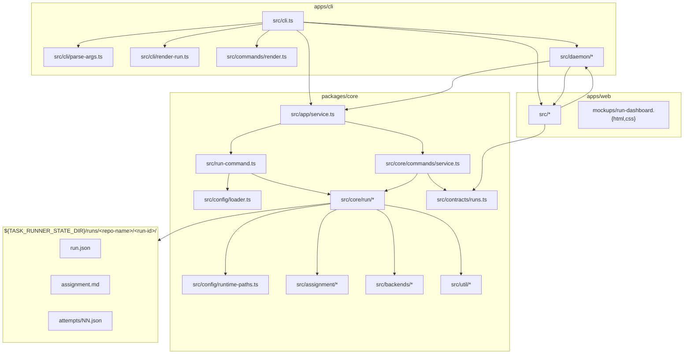

# task-runner

A small, focused CLI that drives an AI coding agent through a structured
task list, tracks per-task status, and retries until every task is
marked done or blocked.

You write a checklist. `task-runner` hands it to a backend (Claude,
Cursor, or Codex), the agent works through it and updates each task's
status in place, and the runner loops until the agent has accounted
for every task: if any are still `pending` when the agent ends its
turn, it gets re-invoked with a nudge — up to a configurable retry
budget. Blocked tasks halt the run cleanly. Aborted runs (Ctrl+C,
external interrupt, timeout) persist their state and can be resumed
later.

Two local host modes:

- **Embedded mode**: the foreground CLI process owns execution.
- **Daemon mode**: `task-runner serve` owns live runs over a local
  control plane. CLI commands route through WebSocket JSON-RPC with
  `--connect` / `TASK_RUNNER_CONNECT`, while browser-style clients
  use HTTP for request/response plus SSE for live run events.

It is intentionally not a web console or a general orchestration
framework. The daemon is local-only.

## Table of contents

- [Why](#why)
- [Features](#features)
- [Install](#install)
- [Quickstart](#quickstart)
- [Documentation](#documentation)
- [Exit codes](#exit-codes)
- [Project layout](#project-layout)
- [Development](#development)
- [License](#license)

---

## Why

If you've used a coding agent for any non-trivial task, you've seen
this loop:

1. You give the agent a list of things to do.
2. The agent confidently announces "all done!"
3. You check, and two of the five things weren't actually done.
4. You write another prompt: "you didn't finish X and Y, try again."
5. Repeat.

`task-runner` wraps that loop. The task list is structured (each task
has a stable id, a title, and a status the agent updates in place),
the runner parses the file after every turn, and a partial completion
just becomes another iteration with a programmatic nudge instead of a
hand-typed follow-up. When the agent gets it right, the run ends and
the runner emits a single JSON record with the full transcript, the
final per-task statuses, and the agent's notes.

It is also a useful primitive for orchestration scenarios — an outer
agent can compose an `assignment.md`, hand it to `task-runner`, and
get back a structured success/failure with no parsing of free-form
chat output.

## Features

- **Four backends** — Claude, Cursor, Codex, and Passive (null-object
  for sidecar flows). See [docs/backends.md](docs/backends.md).
- **Structured task tracking** with a stable id per task and a status
  the agent updates in place. The checklist is a structured reminder
  and audit trail, not a proof of completion — the runner trusts the
  status the agent writes. See [docs/tasks.md](docs/tasks.md).
- **Retries with budget**, blocked-task short-circuit, resumable runs,
  clean Ctrl+C, and external-interrupt detection (Codex). See
  [docs/resume.md](docs/resume.md).
- **Init then execute** — `task-runner init` prepares the workspace
  without invoking the backend, returns a run id; resume later.
- **Dual-host local control plane** — embedded CLI mode or a long-lived
  `task-runner serve` process with WebSocket JSON-RPC, HTTP, and SSE
  transports. See [docs/daemon.md](docs/daemon.md).
- **Run dashboard web app** — `apps/web` ships a same-origin browser
  UI for run status, filtering, archive toggles, and deep-linkable
  detail routes. See [docs/web-dashboard.md](docs/web-dashboard.md).
- **Attachments**, **run dependencies**, and **sidecar task mutation**
  — let a run carry immutable file blobs, declare prerequisite runs,
  and have an external agent drive the checklist through the CLI
  without task-runner ever invoking a backend. See
  [docs/attachments.md](docs/attachments.md),
  [docs/dependencies.md](docs/dependencies.md), and
  [docs/tasks.md#sidecar-pattern](docs/tasks.md#sidecar-pattern).
- **Locked fields** and **caller instructions** — agents and
  assignments can declare which fields the caller is allowed to
  override, and carry a `callerInstructions` block aimed at the
  human/script running task-runner rather than the agent.
- **JSON output mode** for scripting — `status --output-format json`
  returns the shared `RunDetail` DTO, and `run --output-format json`
  writes the final manifest-shaped run record.
- **Recursion guard** so an orchestrator agent can't accidentally
  fork-bomb itself. See [docs/configuration.md](docs/configuration.md).

## Install

Requirements:

- **Node.js 20+**
- **Claude CLI** (`claude`) on your `PATH` if you want the Claude
  backend, or set `TASK_RUNNER_CLAUDE_BIN`.
- **Cursor Agent CLI** (`cursor-agent`) on your `PATH` if you want the
  Cursor backend, or set `TASK_RUNNER_CURSOR_BIN`.
- **Codex CLI** (`codex`) for stdio mode, or a running codex
  app-server reachable over WebSocket via
  `TASK_RUNNER_CODEX_WS_URL=ws://host:port`.

Build (from the repo root):

```bash
npm install
npm run build
```

The built CLI entrypoint is `node apps/cli/dist/cli.js`. Either link
the CLI workspace with `npm link --workspace apps/cli`, add a shell
alias, or invoke it through `npm run task-runner -- ...`. Builds mark
`apps/cli/dist/cli.js` executable on Unix-like systems.

## Quickstart

The examples below assume `task-runner` is on your `PATH`. If it isn't,
substitute `node apps/cli/dist/cli.js` in every command.

```bash
# Run the bundled "example" agent against the bundled "repo-orientation"
# assignment, pointed at any repo:
task-runner run \
  --agent ./agents/example/agent.md \
  --assignment ./assignments/repo-orientation/assignment.md \
  --var repo_path=/path/to/some/repo

# Inspect the run after the fact (or during, with live overlay):
task-runner status <run-id>

# Get the full run detail as JSON:
task-runner status <run-id> --output-format json

# Resume a run with a follow-up message:
task-runner run --resume-run <run-id> "address the flakey test you noticed"
```

A run produces a workspace under
`${TASK_RUNNER_STATE_DIR:-$HOME/.local/state/task-runner}/runs/<repo-name>/<run-id>/`
with `run.json`, `assignment.md`, `attempts/NN.json`, and any
`attachments/`. See [docs/runs.md](docs/runs.md) for the workspace
layout and [docs/concepts.md](docs/concepts.md) for the overall mental
model.

Typical text output:

```
task-runner: agent=example run=abc123
             source=/.../assignments/repo-orientation/assignment.md
             assignment=/.../.local/state/task-runner/runs/<repo-name>/abc123/assignment.md
             cwd=/path/to/some/repo

── attempt 1 ──
<agent output streams here>

── summary ──
Status: success
Tasks completed: 3/3
Attempts: 1/4
Assignment file: /.../.local/state/task-runner/runs/<repo-name>/abc123/assignment.md

Task results:
  - read_conventions — Check repo conventions [completed]
      2-space indent; biome for lint/format; tests via node:test.
  - inventory_packages — Inventory top-level packages [completed]
      ...
  - summary — Summary [completed]
      Small TS monorepo for an AI agent runner with two backends.

To continue this run, provide a follow-up message or add a task:
  task-runner run --resume-run abc123 "..."
```

## Documentation

Start with [docs/concepts.md](docs/concepts.md) for the mental model
(agents / assignments / runs / backends, state machine, where
everything lives). The rest are focused deep-dives:

| Doc | Topic |
|---|---|
| [docs/concepts.md](docs/concepts.md) | Mental model + state machine + doc index |
| [docs/agents-and-assignments.md](docs/agents-and-assignments.md) | File formats, ad-hoc agents, caller instructions, locked fields |
| [docs/tasks.md](docs/tasks.md) | Task model, `taskMode: file` vs `cli`, task CLI, sidecar pattern |
| [docs/runs.md](docs/runs.md) | Workspaces, `run.json`, attempts, schema versioning, reset/archive |
| [docs/backends.md](docs/backends.md) | Claude, Codex, Cursor, Passive adapter details |
| [docs/resume.md](docs/resume.md) | Resume, abort, external interrupts, importing sessions |
| [docs/cli.md](docs/cli.md) | Full CLI reference — every command and flag |
| [docs/daemon.md](docs/daemon.md) | `task-runner serve`, transports, execution provenance |
| [docs/web-dashboard.md](docs/web-dashboard.md) | `apps/web` architecture and dev workflow |
| [docs/attachments.md](docs/attachments.md) | File blobs attached to runs |
| [docs/dependencies.md](docs/dependencies.md) | Prerequisite runs |
| [docs/variables.md](docs/variables.md) | Typed vars, interpolation, locked fields |
| [docs/configuration.md](docs/configuration.md) | Env vars, state layout, recursion guard |
| [docs/examples.md](docs/examples.md) | Bundled agents and assignments |
| [docs/design.md](docs/design.md) | Formal design doc: schema, lifecycle, resume policy |

## Exit codes

| Code | Meaning |
|---|---|
| 0 | All tasks completed successfully (or 0-task chat run succeeded) |
| 1 | Retries exhausted with tasks still incomplete |
| 2 | One or more tasks reported as `blocked` |
| 3 | Config / validation error before any backend was invoked |
| 4 | Backend invocation error (binary not found, spawn failed, etc.) |
| 130 | Run interrupted by user (Ctrl+C) or external cancellation |

## Project layout

Subsystem boundaries are explicit npm workspaces:
`apps/cli` owns the executable transport edge and local daemon host,
`apps/web` owns the browser UI, and `packages/core` owns the
transport-neutral run lifecycle, manifest/task state, shared
contracts, config/assignment loading, backend adapters, and shared
helpers. The daemon is part of the CLI app rather than a separate
package, and the web app is served from the CLI package's built
`dist/` layout for same-origin local use.



```
package.json                # private workspace/orchestration root
tsconfig.base.json          # shared TS compiler options and paths
apps/
├── cli/                    # executable package named task-runner
│   └── src/
│       ├── cli.ts          # CLI entry point and dispatcher
│       ├── cli/            # argv parsing + RunEvent rendering
│       ├── commands/       # text renderers for command/status output
│       └── daemon/         # local WS RPC + HTTP/SSE transport host/client
└── web/                    # browser UI (Vite + React)
packages/
└── core/                   # shared internal workspace package
    └── src/
        ├── app/            # transport-neutral service seam
        ├── assignment/     # task parser/writer/merge/model
        ├── backends/       # claude/codex/cursor/passive adapters + registry
        ├── config/         # definition loading + runtime path helpers
        ├── contracts/      # shared DTOs
        ├── core/           # run lifecycle, status, schema, commands
        ├── run-command.ts  # run/init bootstrap bridge
        ├── task-runner-command.ts
        └── util/           # subprocess + atomic-write helpers

agents/                     # reference agent definitions
assignments/                # reference assignments
docs/                       # focused reference docs — see Documentation above
test/                       # node:test suites
```

For the full design — schema, run lifecycle, manifest format,
locked-field semantics, recursion guard, abort handling, and the
workspace package split — see [docs/design.md](docs/design.md).

## Development

```bash
npm install
npm run build       # builds packages/core then apps/cli
npm run test        # builds and runs all node:test suites
npm run lint        # biome check
npm run format      # biome format --write
```

The repo root is a private npm workspace orchestrator. The shared
runtime lives in `packages/core`, the executable and daemon host live
in `apps/cli`, and the root command surface (`npm run build`, `test`,
`lint`, `check`) orchestrates both.

Pre-commit runs `lint-staged` and `npm run check` via husky.
Workspace `dist/` directories are generated output and are not
committed to git. Packaging rebuilds the CLI artifact via
`npm run prepack`.

Tests are vanilla `node:test`. Backend integration tests use mock
Backend objects to keep them hermetic; the only tests that touch real
subprocesses are a couple of `runProcess` smoke tests against
`/bin/sleep` for the abort path.

## License

TBD.
