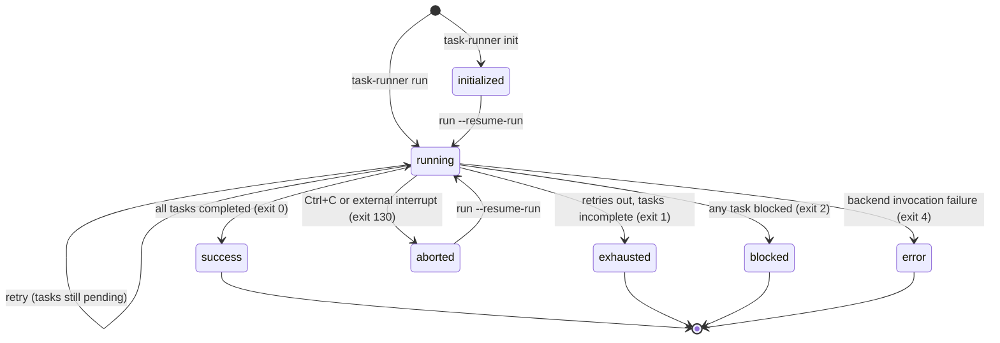
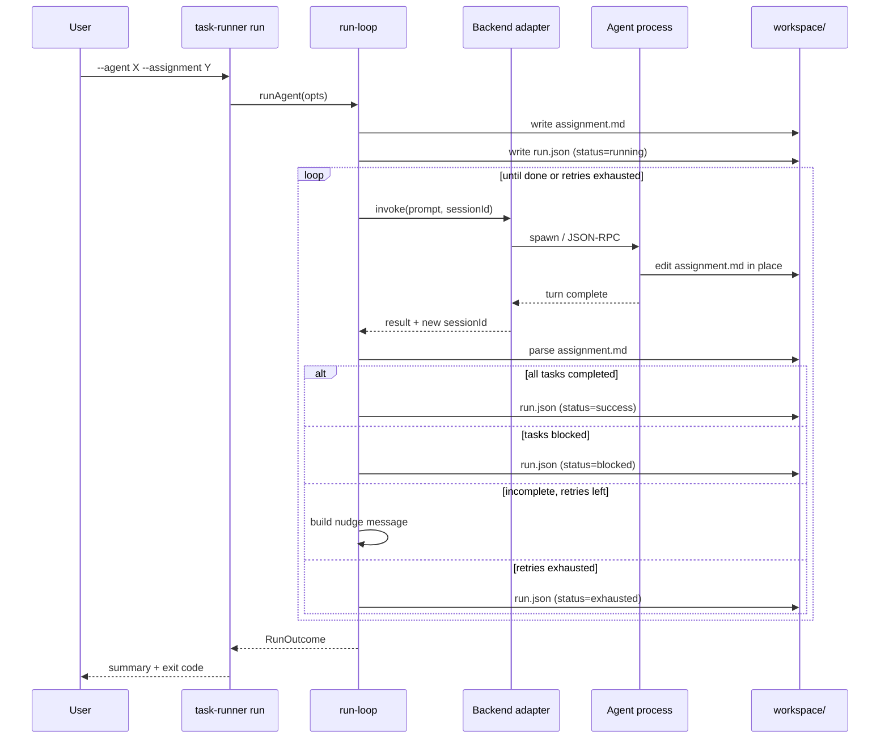

# Concepts

The mental model behind task-runner, in one page. For detailed
references on any piece, follow the links.

## The four moving parts

- **[Agent](agents-and-assignments.md)** — the *identity* (backend,
  model, effort, role instructions, locked fields). Reusable across
  many work packages.
- **[Assignment](agents-and-assignments.md)** — the *work* (task list,
  input variables, optional default message). Reusable across many
  agents.
- **[Run](runs.md)** — a specific agent × assignment × variable binding,
  executed through the run loop, persisted as a manifest on disk.
- **[Backend](backends.md)** — the adapter that turns the run loop's
  abstract "invoke the agent" call into concrete subprocess or RPC
  traffic. Claude, Codex, Cursor, or Passive.

A run is the composition of an agent and an assignment with the
variables resolved. `--agent` and `--assignment` are both optional;
omit them for ad-hoc runs or chat-mode runs.

## Run lifecycle

Terminal states map 1-to-1 onto process exit codes — see the README's
exit-code table.

## What one attempt looks like

See [runs.md](runs.md) for manifest details and the workspace layout,
and [tasks.md](tasks.md) for the task model and workflow preamble.

## Where everything lives

Each run has a workspace at
`${TASK_RUNNER_STATE_DIR}/runs/<repo-name>/<run-id>/`:

- **`run.json`** — the canonical manifest, written after every attempt
  and on terminal state.
- **`assignment.md`** — the I/O buffer the agent edits in place (for
  `taskMode=file`; render-only for `taskMode=cli`).
- **`attempts/NN.json`** — raw per-attempt logs.
- **`attachments/<id>/<name>`** — file blobs bound to the run.

The manifest is the load-bearing piece: it is the canonical source of
truth for a run after first write. Moving, editing, or deleting
`agent.md` after a run has started has no effect on that run — it lives
off the frozen snapshot in `run.json`. See [runs.md](runs.md) for the
schema-version policy.

## Host modes

- **Embedded mode** — the foreground CLI process owns execution.
- **Daemon mode** — `task-runner serve` owns live runs; CLI commands
  route through WebSocket JSON-RPC with `--connect /
  TASK_RUNNER_CONNECT`, while browser clients use HTTP + SSE on the
  same listener.

See [daemon.md](daemon.md) for the full control-plane contract.

---

The inline links above cover the per-topic deep dives. For the full
index of docs, see the [Documentation table in the
README](../README.md#documentation).
